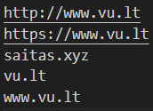

# OOP_papildoma
## Programos tiklas
Programa randa žodžius tekste, kurie pasikartoja daugiau nei 1 kartą, apskaičiuoja jų pasikartojimo skaičių ir randa eilutes, kuriose buvo rastas žodis. Programa, taip pat, randa URL adresus duotame faile.

## Programos naudojimosi instrukcija
- Paleidus programą turėsite įvesti failo pavadinimą, kurį norite išanalizuoti;
- Pirma programa suskaičiuoja kiek kartų žodis pasikartoja tekste (kai žodis pasikartoja daugiau nei 1 kartą) ir įrašo į "kiekiai.txt" failą, turi pasirodyti "Žodžių kiekiai sėkmingai išsaugoti faile: kiekiai.txt" pranešimas;
- Tada programa randa šių žodžių vietą tekste (teksto eilutėse) ir šiuos žodžius ir jų vietas išveda į "vietos.txt" failą, turi pasirodyti "Žodžių vietos sėkmingai išsaugotos faile: vietos.txt" pranešimas;
- Po to programa ieško url adresų, turėsite nuspresti ar norite surastus url rezultatus matyti faile (spauskite 'F') ar terminale (spauskite 'T');
- Priklausomai nuo jūsų pasirinkimo, rezultatus matysite ekrane arba "url.txt" faile.

## Rezultatų pavyzdžiai
"kiekiai.txt" - žodžiai ir jų pasikartojimo skaičius (kurie pasikartoja daugiau nei 1 kartą)

"vietos.txt" - žodžiai ir jų vieta teksto eilutėse

"url.txt" - url adresai

